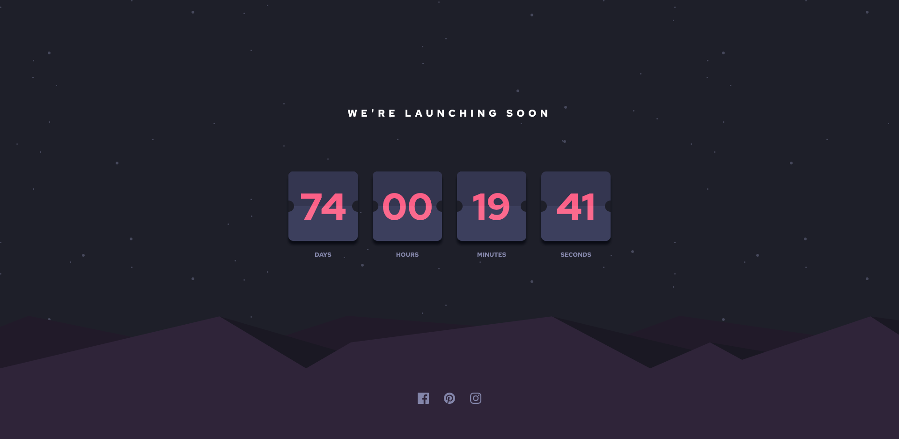

# Frontend Mentor - Launch countdown timer solution

This is a solution to the [Launch countdown timer challenge on Frontend Mentor](https://www.frontendmentor.io/challenges/launch-countdown-timer-N0XkGfyz-). Frontend Mentor challenges help you improve your coding skills by building realistic projects.

## Table of contents

- [Frontend Mentor - Launch countdown timer solution](#frontend-mentor---launch-countdown-timer-solution)
  - [Table of contents](#table-of-contents)
  - [Overview](#overview)
    - [The challenge](#the-challenge)
    - [Screenshot](#screenshot)
    - [Links](#links)
  - [My process](#my-process)
    - [Built with](#built-with)
  - [Author](#author)

## Overview

### The challenge

Users should be able to:

---

- See hover states for all interactive elements on the page
- See a live countdown timer that ticks down every second (start the count at 14 days)
- **Bonus**: When a number changes, make the card flip from the middle

### Screenshot

### Links

- [Solution](https://www.frontendmentor.io/solutions/ip-address-tracker-scss-javascript-fetchcsshtml-Jf-s8MO7sd)
- [Live Site](https://hassaneljebyly.github.io/launch-countdown-timer/public/)

## My process

### Built with

## Author

- Frontend Mentor - [@hassaneljebyly](https://www.frontendmentor.io/profile/hassaneljebyly)
- Twitter - [@HassanElJebyly](https://twitter.com/hassaneljebyly)
